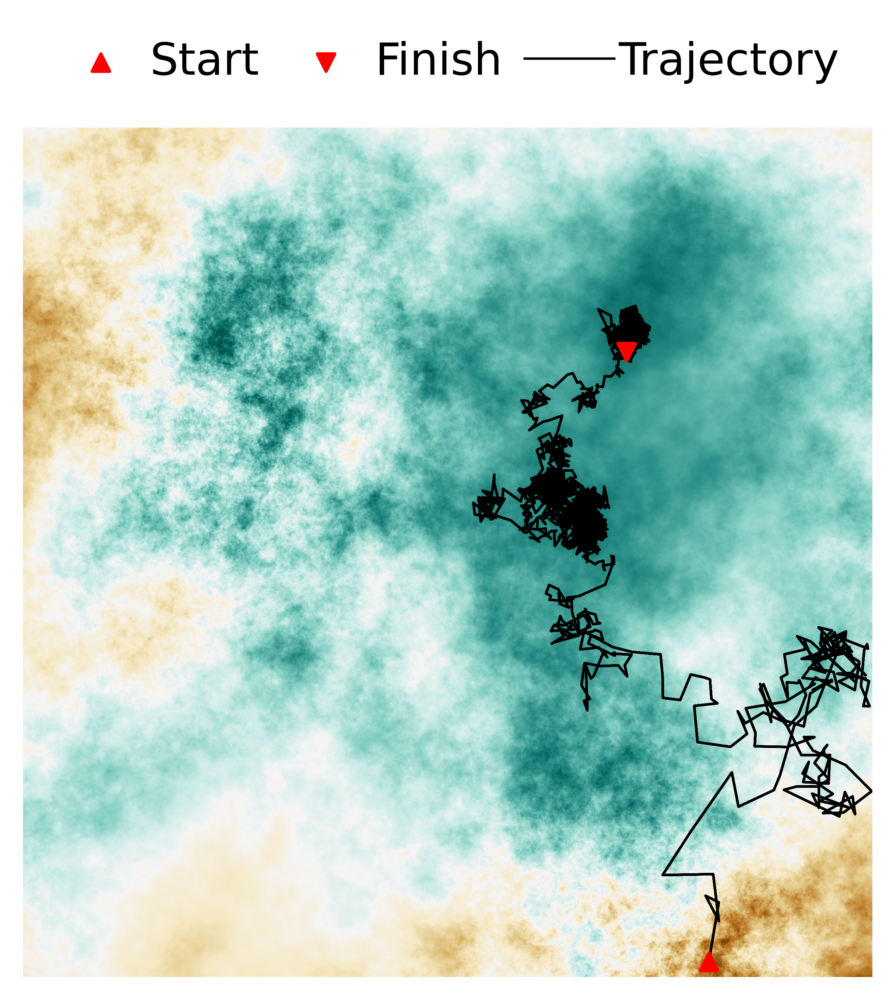

# Optimization on multifractal loss landscapes explains a diverse range of geometrical and dynamical properties of deep learning




## Requirements

To install requirements:

```setup
pip install -r requirements.txt
```

## Simulation and Plots

All code for simulations and plots to reproduce the figures of the paper are included in `demo.ipynb`.